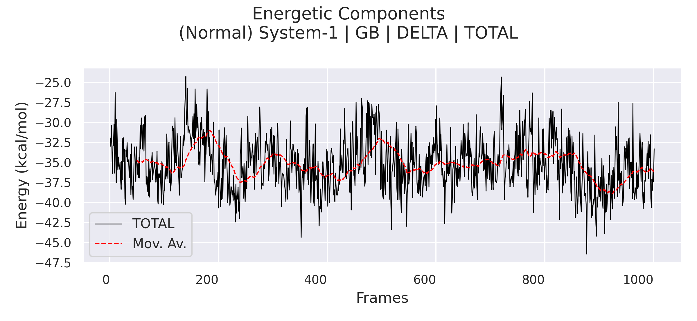
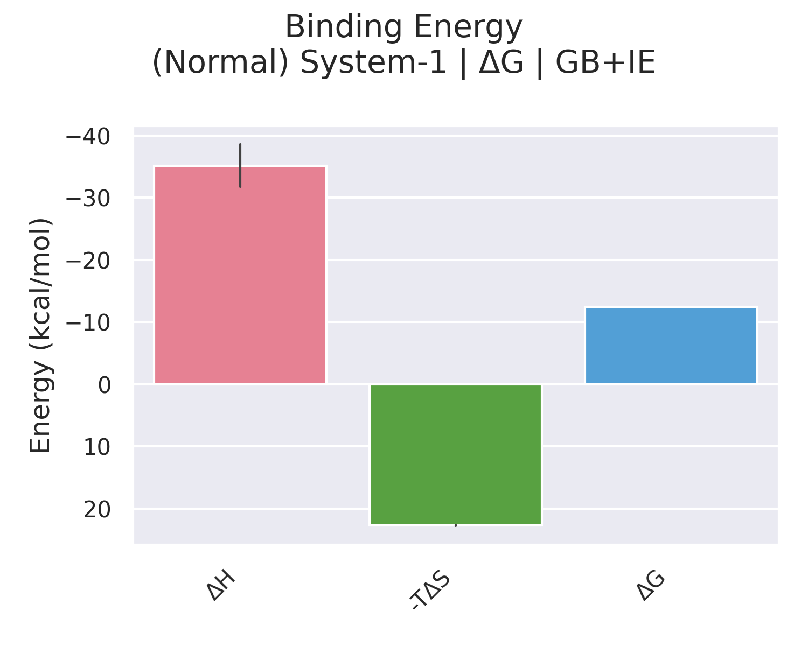
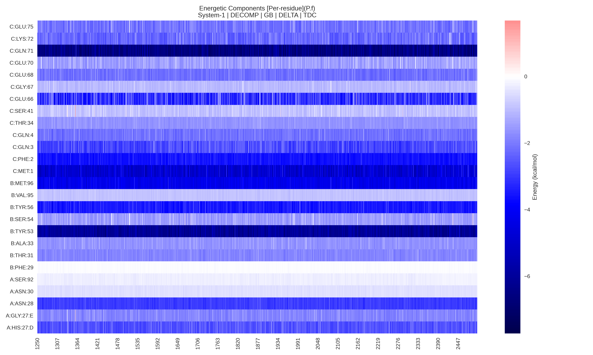
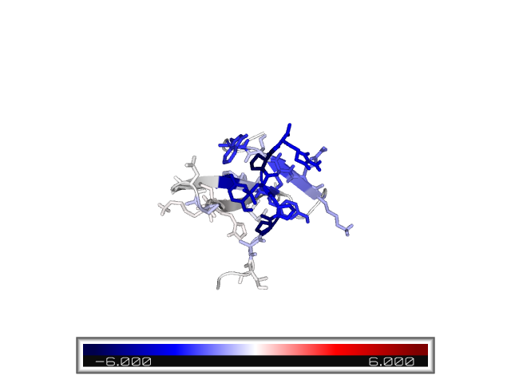

# gmx_MMPBSA_ana v1.5.0: The analyzer tool

## Overview
`gmx_MMPBSA_ana` is a simple but powerful analysis tool. It is mainly focused on providing a fast, easy and 
efficient access to different graphics and analyze gmx_MMPBSA results (**Figure 1**). In this version, 
`gmx_MMPBSA_ana` includes a number of options to customize graphs and save high-quality figures. The tool has 
been optimized to work with many 
charts ([check this section to learn about the potential of `gmx_MMPBSA_ana`](#gmx_mmpbsa_ana-under-pressure)). It 
conserves the essence of its predecesor `gmx_MMPBSA_ana v1.4.3`, although the API that uses in the backend is quite 
different, making it incompatible with files from previous versions.

## gmx_MMPBSA_ana components

1. [System selection window](#1-system-selection-window)
2. [Data/Correlation panel](#2-datacorrelation-panel)
3. [Options panel](#3-options-panel)
4. [Plot area](#4-plot-area)
5. [Menus](#5-menus)

<figure markdown="1">
[![overview][2]][2]
  <figcaption markdown="1" style="margin-top:0;">
**Figure 1.** `gmx_MMPBSA_ana` graphical overview
  </figcaption>
</figure>

[2]: assets/images/gmx_mmpbsa_ana_overview.png

### 1- System selection window
This dialog allows you to select the system(s) of interest, as well as its components. In this panel you can check a 
number of options that will define how `gmx_MMPBSA_ana` process the result file. These options are:

* select whether you want to include mutants, normals, or both systems when analyzing alanine scanning results. 
* delete the terms whose values during the analysis were between `-0.01` and `0.01`
* show/not-show decomposition analyses (which usually contains lots of data)
* transform the frames range to timescale
* calculate the correlation between various systems
  
This allows you to take advantage of the flexibility of `gmx_MMPBSA` to carry out several analysis types in the same 
run and focus on the key elements for each of these analyses.

### 2- Data/Correlation panel
This panel is made up of two independent sub-panels: Data and Correlation with slightly different characteristics, 
but with the same essence.

#### Structure
=== "Data"
    This panel is tree-like, where each system marked in gray is a top-level element that contains a set 
    of 'children' elements organized according to the calculation type. Each upper-level element can be 
    expanded/collapsed, which allows you to take advantage of the space and manipulate a considerable number of systems 
    at the same time while keeping the elements of interest at sight.
=== "Correlation"
    We are working on its implementation.

#### Buttons and Actions
Each item represents a set of data associated with a type of calculation, and a component (_i.e._ complex, receptor, 
ligand, delta, etc...). These, in turn, have buttons and actions depending on the data they contain. Each item can 
have a total of 7 buttons that represent:

|       Button       | Visual element             | Description                                                                                                        |
|:------------------:|----------------------------|--------------------------------------------------------------------------------------------------------------------|
| ![resultfiles][3]  | Result files               | Show/hide in a new sub-window the **gmx_MMPBSA** output files: `FINAL_RESULTS_MMPBSA.dat` and `FINAL_DECOMP_MMPBSA.dat` |
|   ![lineplot][4]   | Line plot                  | Show/hide in a new sub-window a Line plot                                                                               |
|   ![barplot][5]    | Bar plot                   | Show/hide in a new sub-window a Bar plot                                                                                |
|   ![heatmap][6]    | Heatmap                    | Show/hide in a new sub-window a Heatmap plot                                                                            |
|    ![pymol][7]     | PyMOL visualization        | Show/hide the complex per-residue energy representation in a new PyMOL instance                                         |
| ![summarytable][8] | Summary table              | Show/hide the summary table of the parent element with multiple energetic components as 'childrens'                                   |
|  ![multiacti][9]   | Multiple activation button | Show/hide all items (Line, bar, heatmap plots and PyMOL) at the same time   

[3]: assets/images/result_files_icon.svg
[4]: assets/images/line_plot_icon.svg
[5]: assets/images/bar_plot_icon.svg
[6]: assets/images/heatmap_plot_icon.svg
[7]: assets/images/pymol_icon.svg
[8]: assets/images/summary_table_icon.svg
[9]: assets/images/multi_button_icon.svg

In turn, some buttons have a drop-down menu that allows you to display the content of that specific graph in table 
form. In particular, the multiple activation button allows you to show/hide all the visual elements associated with a 
certain item.

Example:
<figure markdown="1">
[![buttonexample][10]][10]
  <figcaption markdown="1" style="margin-top:0;">
**Figure 2.** Button representation example
  </figcaption>
</figure>

[10]: assets/images/buttons_example.png

### 3- Options panel
In this panel you can find two tabs:

=== "Charts Options"
    Contains five different menus:

    * `General` controls settings such as theme, figure-save-format, etc.
    * `Line Plot` controls line plots settings such as line-width, line-color, rolling-average line appearance, etc.
    * `Bar Plot` controls bar plots settings such as bar-color, bar-label appearance, etc.
    * `Heatmap Plot` controls heatmap plots settings such as receptor- and ligand-colors, color-palette, etc.
    * `Visualization` controls PyMOL visualization settings such as color-palette, background-color, 
    representation, etc.

=== "Frames"
    Contains two windows:

    * `Energy` changes start, end and interval between frames.
    * `IE` changes segment considered for calculating the Interaction Entropy

### 4- Plot area
In this area, the graphs and tables included in each system will be displayed in the form of sub-windows 
(multi-document interface). This format allows you to move, resize and close each sub-window, offering a clean, 
organized, and fluid workspace to analyze a vast number of graphs.

#### Types of charts
=== "Line plot"
    Represents the evolution of a component during the simulation time. In some cases, it is the value of the calculated 
    parameter, _e.g._: `TOTAL DELTA`, `VDWAALS`, etc.; and in others, it is the sum of the elements it contains, eg: 
    `TDC` as the sum of all the per-residue energy contributions.
    
    !!! note
        The line plot can additionally contain the moving average (solid red line) or other elements such as other 
        indicators (dash red and green lines).
    
    !!! warning 
        Note that `TDC`, `SDC`, and `BDC` are calculated from the immediate items contained within themselves. 
        This means that the results obtained for the `TDC` in a per-residue calculation will probably be different 
        from the `TDC` of a per-wise calculation with the same residues. This is because the per-residue energy 
        contribution is calculated taking into account the environment that surrounds each residue, so the sum of 
        their contributions will be exactly the maximum contribution per selected residues. On the other hand, in 
        the per-wise calculation, the `TDC` will be equal to the sum of each residue contribution, the difference 
        being that the contribution of each residue is obtained from the contributions of the selected pairs and not 
        with all the environment that surrounds it. Therefore, both calculations should be used for different 
        purposes and care should be taken with the interpretation of the results.
    
    <figure markdown="1">
    { width=75% style="display: block; margin: 0 auto"}
    { width=69% style="display: block; margin: 0 auto"}
      <figcaption markdown="1" style="margin-top:0;">
      **Figure 2**. Line plot examples. **Up:** ΔH representation, **Down:** Interaction Entropy representation
      </figcaption>
    </figure>

=== "Bar plot"
    Represents the total contribution of a component for the simulation. In some cases, it is the average of the 
    calculated 
    parameter, _e.g._: `TOTAL DELTA`, `VDWAALS`, RESIDUES in per-residue calculation, etc., and in others, it is the 
    sum of the elements it contains, _e.g._: NMODE and QH Entropy, ΔG Binding, etc. The bars that represent averages 
    also have a solid line that represents the standard deviation.
    
    <figure markdown="1">
    { width=75% style="display: block; margin: 0 auto"}
    { width=30% style="display: block; margin: 0 auto"}
      <figcaption markdown="1" style="margin-top:0;">
      **Figure 3**. Bar plot examples. **Up:** Per-residue contribution, **Down:** ΔG Binding
      </figcaption>
    </figure>

=== "Heatmap plot"
    Represents the evolution of several components at the same time during the simulation. It is used to represent the 
    contribution of all residues in per-residue calculation or all pairs of atoms for each residue in the per-wise 
    calculation. It could also represent the relationship between components. This is explicit for per-wise 
    calculations and represents the contribution of each residue with its respective pairs.
    
    !!! tip
        The relational heatmap graph is the best representation in the per-wise analysis.
    
    <figure markdown="1">
    { width=75% style="display: block; margin: 0 auto"}
    { width=60% style="display: block; margin: 0 auto"}
      <figcaption markdown="1" style="margin-top:0;">
      **Figure 4**. Heatmap plot examples. **Up:** Per-residue contribution per-frame, **Down:** Inter Residue-pair 
    contribution
      </figcaption>
    </figure>

=== "PyMOL visualization"
    Show the complex per-residue energy representation in a new PyMOL instance.

    <figure markdown="1">
    { width=75% style="display: block; margin: 0 auto"}
      <figcaption markdown="1" style="margin-top:0;">
      **Figure 5**. PyMOL visualization
      </figcaption>
    </figure>

### 5- Menus
This section contains three drop-down menus:

=== "File"
    * Close all -- closes all the graphs
=== "View"
    * Show Data -- shows data subpanel
    * Show Correlation -- shows correlation subpanel
    * Show Options -- shows options panel
    * Tile SubWindows -- organizes graphs as tile
    * Cascade SubWindows -- organizes graphs as cascade
=== "About"
    * Help -- shows [gmx_MMPBSA_ana page](https://valdes-tresanco-ms.github.io/gmx_MMPBSA/analyzer)
    * Documentation -- shows [gmx_MMPBSA page](https://valdes-tresanco-ms.github.io/gmx_MMPBSA/getting-started)
    * Report a bug -- opens issue and report a bug on [GitHub](https://github.com/Valdes-Tresanco-MS/gmx_MMPBSA/issues/new/choose)
    * Google group -- opens [gmx_MMPBSA Google Group](https://groups.google.com/g/gmx_mmpbsa)
    * About gmx_MMPBSA_ana -- shows gmx_MMPBSA citation

---------------------------------------

## Representations

!!! note
    The following videos provide a visual medium to facilitate the use of `gmx_MMPBSA_ana`. These videos were recorded 
    with the previous version of `gmx_MMPBSA_ana`, v1.4.3. We are working with several content creators to provide 
    more accurate video tutorials. 

    If you find our tool 
    useful and want to use it for a visual project, such as tutorials, examples, etc., we will gladly include it 
    in the documentation as well as in the list of acknowledgments and collaborators.

### Binding Free Energy calculation (GB + IE) 

    <iframe src="https://www.youtube.com/embed/k1aLlBhnkxo" frameborder="0" allowfullscreen></iframe>

### Correlation analysis

    <iframe src="https://www.youtube.com/embed/0xiphzA1O0w" frameborder="0" allowfullscreen></iframe>

### Alanine scanning

    <iframe src="https://www.youtube.com/embed/_r13tcmY038" frameborder="0" allowfullscreen></iframe>

### Per-residue decomposition

    <iframe src="https://www.youtube.com/embed/Ww7juWeWQQ8" frameborder="0" allowfullscreen></iframe>

### Functionalities

    <iframe src="https://www.youtube.com/embed/PgDnG8UgRWw" frameborder="0" allowfullscreen></iframe>

## `gmx_MMPBSA_ana` under pressure

!!! warning
    Around 1.8 million graphs were loaded in gmx_MMPBSA_ana, and it is showed only for educational purposes.

    <iframe src="https://www.youtube.com/embed/xRIi3LtB7wU" frameborder="0" allowfullscreen></iframe>

In this experiment, we replicated our examples folder 9 times (differs from the one available on GitHub) giving us a 
total of 99 systems. As you can see in the video, gmx_MMPBSA_ana manages to deal well with the incredible amount of ~1.6 
million items. Every item contains between 1 and 3 graphics, for a total of ~1.8 million graphics loaded. This feat is 
accomplished in ~11 minutes. Most of this time is consumed processing the data associated with each graph. At the 
moment, gmx_MMPBSA_ana processes this data serially, since parallelizing this process would be a bit difficult. In 
any case, for the usual processes, this will take a maximum of 25-30 seconds, depending on your hardware. Each item has 
associated the data of each of its graphs, which is stored in memory. In this experiment, RAM consumption reached up 
to 14 GB.

!!! danger
    Be aware that if you run out of available RAM, your OS could crash, freeze, or slow down.

Does this mean that you will not be able to load 100 systems in `gmx_MMPBSA_ana`?
Not at all. Consumption depends on the type of calculation you have made, and the data you want to analyze. In this
experiment, there were several systems that contain the `decomp` data. We also selected to show the complex, receptor, and 
ligand data, which usually can be skipped. Only a system calculated with per-wise selecting about 40 amino acids 
generates about 11 thousand items.

