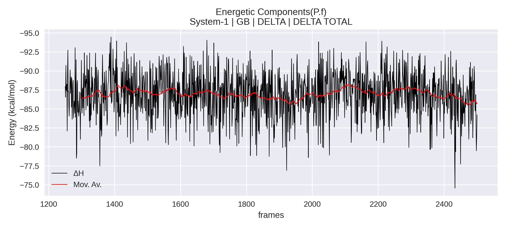
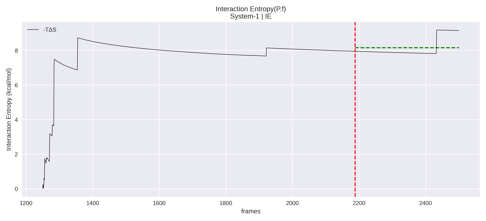
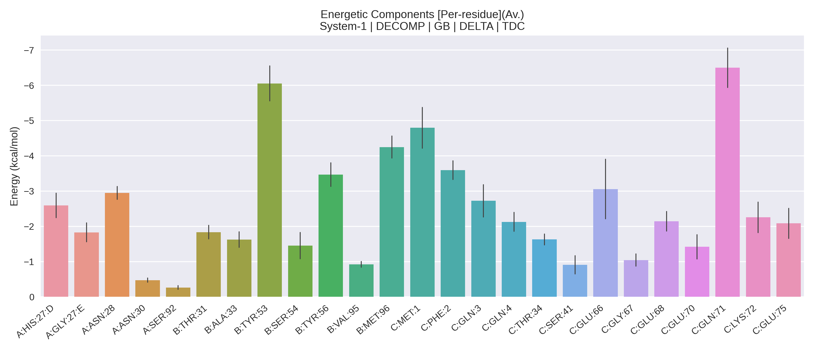
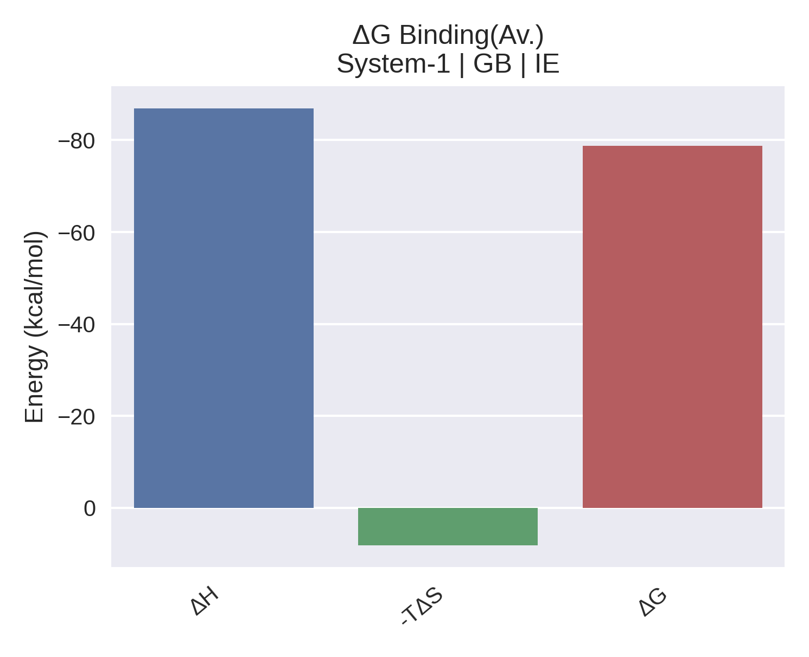
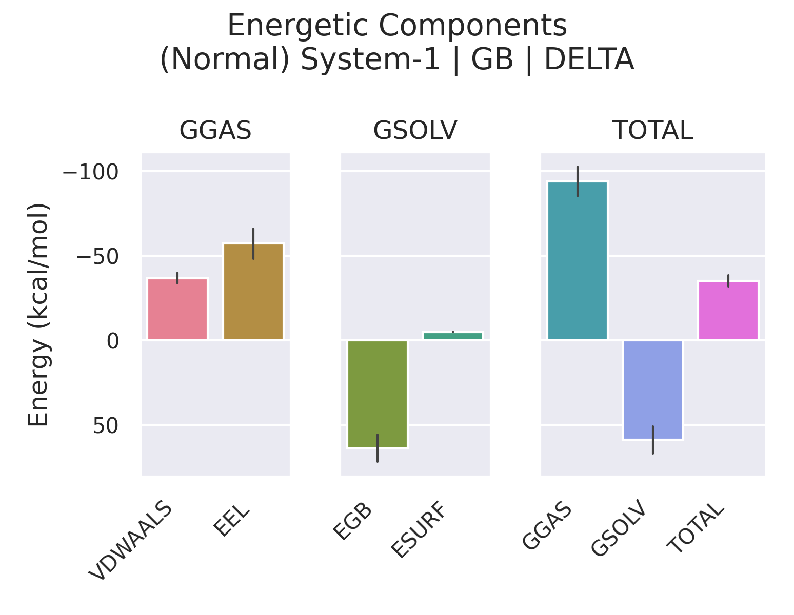
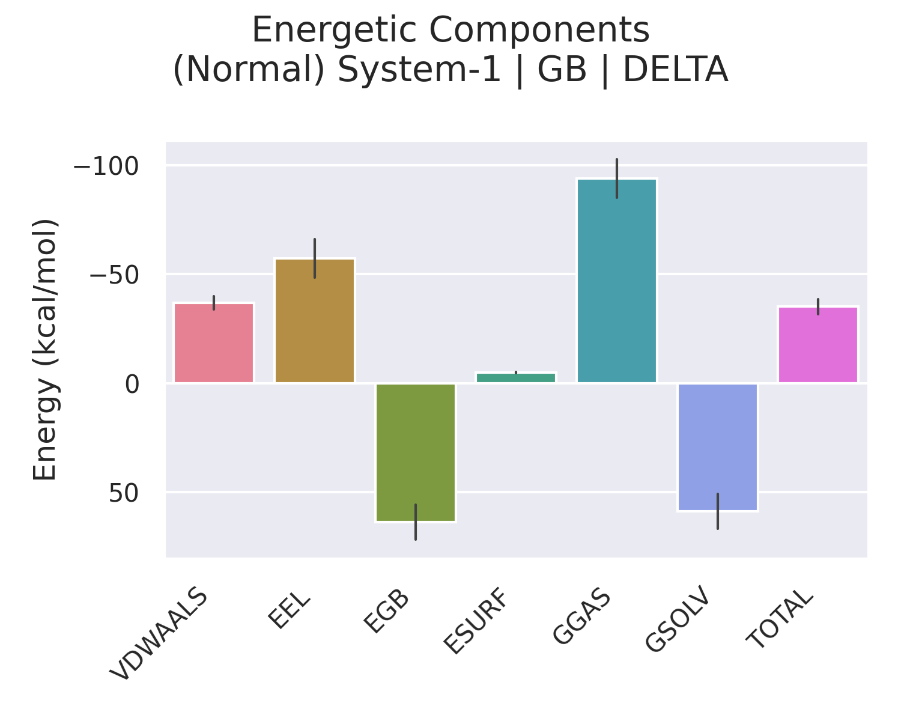
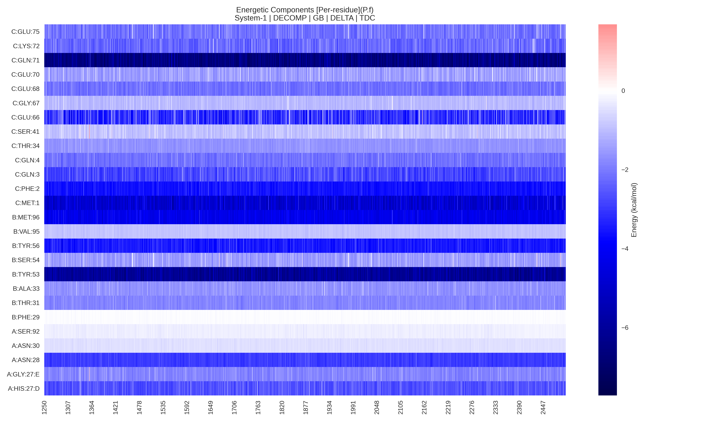
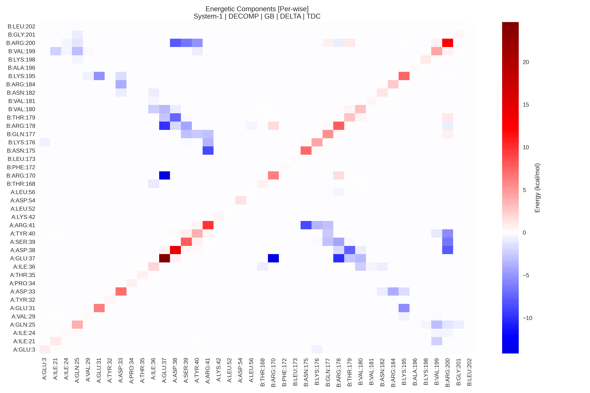
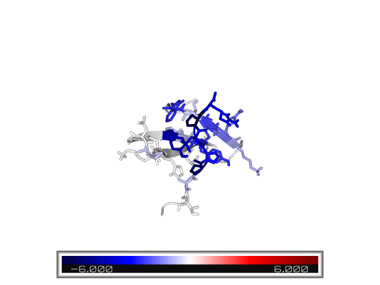

# gmx_MMPBSA_ana: The analyzer tool

## Overview
`gmx_MMPBSA_ana` is a simple but powerful tool for analyzing gmx_MMPBSA results. It provides fast access to several
types of plots and includes options for customizing graphs and exporting high-quality figures (**Figure 1**). The tool
has been optimized to handle many charts ([see the performance section](#gmx_mmpbsa_ana-under-pressure)). It retains
the core design of its predecessor, `gmx_MMPBSA_ana v1.4.3`, but uses a substantially different back-end API and is
therefore incompatible with files from earlier versions.

## Fast like a rocket
After version 1.5.2, gmx_MMPBSA_ana experienced serious performance problems. We reworked its implementation from the
ground up; the benchmark results are shown below.

!!! note "Historical benchmark"
    The performance table below is a historical v1.5.5 benchmark. Hardware and software details are not recorded
    here, so it should not be interpreted as a current performance claim for the 1.7.0 release.

| Number of systems/CPUs | Type                    | Frames | v1.5.2 | v1.5.2+20 | v1.5.5 | Improvement |
|:----------------------:|-------------------------|:------:|:------:|:---------:|:------------:|:-----------:|
|           1            | Energy                  | 200000 |  fail  |   960s    |     17s      |   **56x**   |
|           4            | Energy                  | 200000 |  fail  |   4515s   |     17s      |  **265x**   |
|           1            | Energy+Decomp(per-wise) |   11   |  fail  |   192s    |      9s      |   **21x**   |
|           4            | Energy+Decomp(per-wise) |   11   |  fail  |   960s    |     14s      |   **69x**   |

To this end, we have made the following changes:

- Reimplemented multiprocessing for reading systems.
- Implemented multithreading for data processing.
- Improved the reading of output files and optimized data storage. 
- Eliminated the recalculation of IE and C2 entropies before opening the GUI; values are now read from output files.
- Optimized data storage and access to subsets in pandas DataFrames.
- Prevented file processing and figure generation from freezing the GUI.
- Removed redundant steps and data.
- Removed line graphs for components in the per-wise decomposition schema.
- Data access, processing, and storage are done in the API.
- Added the option to temporarily store data on the hard disk instead of memory.
- Removed several pop-up windows.
- Added waiting indicators.
- Added multiple systems, subsystems, and component selection options.

## gmx_MMPBSA_ana components

1. [System selection window](#1-system-selection-window)
2. [Data/Correlation panel](#2-datacorrelation-panel)
3. [Options panel](#3-options-panel)
4. [Plot area](#4-plot-area)
5. [Menus](#5-menus)

<figure markdown="1">
[![overview][2]][2]
  <figcaption markdown="1" style="margin-top:0;">
**Figure 1.** `gmx_MMPBSA_ana` graphical overview
  </figcaption>
</figure>

[2]: assets/images/gmx_mmpbsa_ana_overview.png

### 1- System selection window
This dialog allows you to select the systems of interest and their components. The available options control how
`gmx_MMPBSA_ana` processes the result files:

* select whether you want to include mutants, normals, or both systems when analyzing alanine scanning results
* delete the terms whose values during the analysis were between `-0.01` and `0.01`
* show or hide decomposition analyses, which usually contain large amounts of data
* convert the frame range to a time scale
* calculate the correlation between various systems
  
This allows you to take advantage of the flexibility of `gmx_MMPBSA` to carry out several analysis types in the same 
run and focus on the key elements for each of these analyses.

### 2- Data/Correlation panel
This panel contains two independent subpanels, Data and Correlation, which have similar organization but slightly
different functions.

#### Structure
=== "Data"
    This panel uses a tree structure. Each system shown in gray is a top-level item containing child items organized by
    calculation type. You can expand or collapse each top-level item to manage many systems while keeping the relevant
    items visible.
=== "Correlation"
    We are working on its implementation.

#### Buttons and Actions
Each item represents data associated with a calculation type and component (_e.g._, complex, receptor, ligand, or
delta). The available buttons and actions depend on the data in the item. An item can have up to seven buttons:

|       Button       | Visual element             | Description                                                                                                             |
|:------------------:|----------------------------|-------------------------------------------------------------------------------------------------------------------------|
| ![resultfiles][3]  | Result files               | Show/hide in a new sub-window the **gmx_MMPBSA** output files: `FINAL_RESULTS_MMPBSA.dat` and `FINAL_DECOMP_MMPBSA.dat` |
|   ![lineplot][4]   | Line plot                  | Show/hide in a new sub-window a Line plot                                                                               |
|   ![barplot][5]    | Bar plot                   | Show/hide in a new sub-window a Bar plot                                                                                |
|   ![heatmap][6]    | Heatmap                    | Show/hide in a new sub-window a Heatmap plot                                                                            |
|    ![pymol][7]     | PyMOL visualization        | Show/hide the complex per-residue energy representation in a new PyMOL instance                                         |
| ![summarytable][8] | Summary table              | Show/hide the summary table for a parent item with multiple energy components                                           |
|  ![multiacti][9]   | Multiple activation button | Show/hide all items (Line, bar, heatmap plots and PyMOL) at the same time                                               |

[3]: assets/images/result_files_icon.svg
[4]: assets/images/line_plot_icon.svg
[5]: assets/images/bar_plot_icon.svg
[6]: assets/images/heatmap_plot_icon.svg
[7]: assets/images/pymol_icon.svg
[8]: assets/images/summary_table_icon.svg
[9]: assets/images/multi_button_icon.svg

In turn, some buttons have a drop-down menu that allows you to display the content of that specific graph in table 
form. In particular, the multiple activation button allows you to show/hide all the visual elements associated with a 
certain item.

Example:
<figure markdown="1">
[![buttonexample][10]][10]
  <figcaption markdown="1" style="margin-top:0;">
**Figure 2.** Button representation example
  </figcaption>
</figure>

[10]: assets/images/buttons_example.png

### 3- Options panel
In this panel you can find two tabs:

=== "Charts Options"
    Contains five menus:

    * `General` controls settings such as the theme and figure export format.
    * `Line Plot` controls settings such as line width, line color, and the appearance of rolling-average lines.
    * `Bar Plot` controls settings such as bar color and label appearance.
    * `Heatmap Plot` controls settings such as receptor and ligand colors and the color palette.
    * `Visualization` controls PyMOL settings such as the color palette, background color, and representation.

=== "Frames"
    Contains two windows:

    * `Energy` changes start, end and interval between frames.
    * `IE` changes segment considered for calculating the Interaction Entropy.

### 4- Plot area
In this area, the graphs and tables included in each system will be displayed in the form of sub-windows 
(multi-document interface). This format allows you to move, resize and close each sub-window, offering a clean, 
organized, and fluid workspace to analyze a vast number of graphs.

#### Types of charts
=== "Line plot"
    Represents the evolution of a component during the simulation time. In some cases, it is the value of the calculated 
    parameter, _e.g._: `TOTAL DELTA`, `VDWAALS`, etc.; and in others, it is the sum of the elements it contains, eg: 
    `TDC` as the sum of all the per-residue energy contributions.
    
    !!! note
        The line plot can additionally contain the moving average (solid red line) or other elements such as other 
        indicators (dash red and green lines).
    
    !!! warning 
        Note that `TDC`, `SDC`, and `BDC` are calculated from the immediate items contained within themselves. 
        This means that the results obtained for the `TDC` in a per-residue calculation will probably be different 
        from the `TDC` of a per-wise calculation with the same residues. This is because the per-residue energy 
        contribution is calculated taking into account the environment that surrounds each residue, so the sum of 
        their contributions will be exactly the maximum contribution per selected residues. On the other hand, in 
        the per-wise calculation, the `TDC` will be equal to the sum of each residue contribution, the difference 
        being that the contribution of each residue is obtained from the contributions of the selected pairs and not 
        with all the environment that surrounds it. Therefore, both calculations should be used for different 
        purposes and care should be taken with the interpretation of the results.
    
    <figure markdown="1">
    { width=75%; style="display: block; margin: 0 auto"}
    { width=69%; style="display: block; margin: 0 auto"}
      <figcaption markdown="1" style="margin-top:0;">
      **Figure 2**. Line plot examples. **Up:** ΔH representation, **Down:** Interaction Entropy representation
      </figcaption>
    </figure>

=== "Bar plot"
    Shows the aggregate contribution of a component over the simulation. Depending on the quantity, a bar represents
    either an average (for example, `TOTAL DELTA`, `VDWAALS`, or per-residue contributions) or a sum (for example,
    NMODE entropy, QH entropy, or binding free energy). Bars that represent averages also include a solid line for
    the standard deviation.
    
    <figure markdown="2">
        { width=60%; style="display: block; margin: 0 auto"}
        { width=40%; style="display: block; margin: 0 auto"}
        <figcaption markdown="2" style="margin-top:0;">
        **Figure 3**. Bar plot examples. **Up:** Per-residue contribution, **Down:** ΔG Binding
        </figcaption>
    </figure>

    <figure markdown="2">
        { width=40%; style="display: block; margin: 0 auto"}
        { width=40%; style="display: block; margin: 0 auto"}
        <figcaption markdown="2" style="margin-top:0;">
        **Figure 4.** Bar plot examples. **Up:** Energetic terms plotted by subcomponents, **Down:** All energetic 
        terms in the same plot.
        </figcaption>
    </figure>

=== "Heatmap plot"
    Shows how several components evolve during the simulation. A heatmap can display all residue contributions in a
    per-residue calculation or the relationships between residue pairs in a pairwise calculation.
    
    !!! tip
        The relational heatmap is usually the clearest representation for pairwise decomposition analysis.
    
    <figure markdown="1">
    { width=75% style="display: block; margin: 0 auto"}
    { width=60% style="display: block; margin: 0 auto"}
      <figcaption markdown="1" style="margin-top:0;">
      **Figure 5.** Heatmap examples. **Top:** Per-residue contribution by frame. **Bottom:** Inter-residue pair
      contributions.
      </figcaption>
    </figure>

=== "PyMOL visualization"
    Shows the complex per-residue energy representation in a new PyMOL instance.

    <figure markdown="1">
    
      <figcaption markdown="1" style="margin-top:0;">
      **Figure 6**. PyMOL visualization
      </figcaption>
    </figure>

### 5- Menus
This section contains three drop-down menus:

=== "File"
    * Close all -- closes all the graphs
=== "View"
    * Show Data -- shows data subpanel
    * Show Correlation -- shows correlation subpanel
    * Show Options -- shows options panel
    * Tile SubWindows -- arranges graphs in a tiled layout
    * Cascade SubWindows -- arranges graphs in a cascading layout
=== "About"
    * Help -- shows [gmx_MMPBSA_ana page](analyzer.md)
    * Documentation -- shows [gmx_MMPBSA page](getting-started.md)
    * Report a bug -- opens the [GitHub issue form](https://github.com/Valdes-Tresanco-MS/gmx_MMPBSA/issues/new/choose)
    * Google group -- opens [gmx_MMPBSA Google Group](https://groups.google.com/g/gmx_mmpbsa)
    * About gmx_MMPBSA_ana -- shows gmx_MMPBSA citation

---------------------------------------

## Representations

!!! note
    The following videos demonstrate how to use `gmx_MMPBSA_ana`. They were recorded with an earlier version
    (`v1.4.3`), so some interface details may differ from the current release.

    If you create a tutorial or another visual resource featuring the tool, contact us and we can consider linking it
    from the documentation and acknowledging your contribution.

### Functionalities

    <iframe src="https://www.youtube.com/embed/PgDnG8UgRWw" frameborder="0" allowfullscreen></iframe>

### Binding Free Energy calculation (GB + IE) 

    <iframe src="https://www.youtube.com/embed/k1aLlBhnkxo" frameborder="0" allowfullscreen></iframe>

### Alanine scanning

    <iframe src="https://www.youtube.com/embed/_r13tcmY038" frameborder="0" allowfullscreen></iframe>

### Per-residue decomposition

    <iframe src="https://www.youtube.com/embed/Ww7juWeWQQ8" frameborder="0" allowfullscreen></iframe>

[comment]: <> (### Correlation analysis)

[comment]: <> (
)

[comment]: <> (    <iframe src="https://www.youtube.com/embed/0xiphzA1O0w" frameborder="0" allowfullscreen></iframe>)

[comment]: <> (
)

## `gmx_MMPBSA_ana` under pressure

!!! warning
    This stress test loaded approximately 1.8 million graphs. It is shown only to demonstrate performance at an
    unusually large scale.

    <iframe src="https://www.youtube.com/embed/xRIi3LtB7wU" frameborder="0" allowfullscreen></iframe>

For this experiment, the examples directory was replicated nine times to produce 99 systems; this differs from the
examples available on GitHub. The analyzer loaded approximately 1.6 million items, each containing one to three
graphs, for a total of roughly 1.8 million graphs. Loading took about 11 minutes, primarily because the data associated
with each graph was processed serially. Typical workloads take about 25-30 seconds, depending on the hardware and data.
Because each graph's data is retained in memory, RAM use reached approximately 14 GB during this stress test.

!!! danger
    Be aware that if you run out of available RAM, your OS could crash, freeze, or slow down.

Does this mean that you will not be able to load 100 systems in `gmx_MMPBSA_ana`?
Not at all. Consumption depends on the type of calculation you have made, and the data you want to analyze. In this
experiment, several systems contained decomposition data, and the complex, receptor, and ligand components were all
selected even though some are usually omitted. A single pairwise calculation involving about 40 amino acids can
generate approximately 11,000 items.
