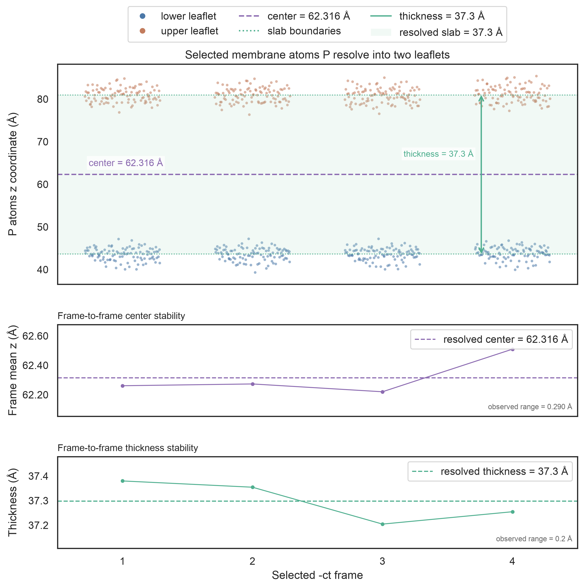

# Protein-ligand binding in a membrane

This example calculates the binding free energy of ubiquinone (`UQ2`) to a membrane protein (`PROA`). The source
system was prepared with CHARMM-GUI and contains an explicit DOPC/POPC bilayer, solvent, and ions. The calculation
uses a heterogeneous implicit-membrane PB model.

<div class="example-card-grid" markdown>

-   **Protocol**

    Single trajectory

-   **Force field**

    CHARMM

-   **Membrane model**

    Heterogeneous PB (`memopt=2`)

-   **Bundled test**

    `gmx_MMPBSA_test -t 6`

</div>

!!! info "Representative system"
    This membrane protein-ligand complex demonstrates the heterogeneous implicit-membrane PB workflow for a CHARMM
    topology. CHARMM support is not limited to this molecular composition, but implicit-membrane calculations
    require compatible membrane geometry and method-specific settings.

!!! warning "CHARMM CMAP conversion"
    The current GROMACS-to-AMBER topology conversion omits CHARMM CMAP terms and reports this during setup. The
    example exercises the complete implicit-membrane workflow, but quantitative CHARMM applications should assess
    the effect of the missing CMAP contribution before interpreting binding energies.

!!! note "CHARMM PB radii"
    `PBRadii=7` selects the `charmm_radii` set, which is intended only for systems prepared with CHARMM force fields.
    Its protein radii draw on work by [Nina, Belogv, and Roux][10], nucleic-acid radii on [Banavali and Roux][11],
    and additional elements on [Fortuna and Costa][12]. With `radiopt=0`, PBSA uses these radii from the generated
    AMBER topologies.

## Before you begin

The manual workflow uses the following files and selections:

<div class="example-card-grid" markdown>

-   **Calculation settings**

    `mmpbsa.in` (`-i`)

-   **GROMACS system**

    Structure `com.pdb` (`-cs`) and topology `topol.top` (`-cp`). Keep the `toppar` directory containing the
    referenced CHARMM `*.itp` files beside `topol.top`.

-   **Trajectory**

    Fitted four-frame trajectory `md.xtc` (`-ct`), with the membrane normal aligned to the *z* axis

-   **Molecular selections**

    Index `index.ndx` (`-ci`) with receptor `PROA` and ligand `UQ2` (`-cg`)

</div>

The complete structure contains 95,472 atoms: protein, ligand, DOPC/POPC lipids, ions, and TIP3 water. The selected
binding system contains the 2,985-atom receptor and 49-atom ligand. See the [complete command-line reference][2] for
all options.

## Run the example

### Run the bundled test

The quickest way to reproduce this example is through the test runner:

```bash
gmx_MMPBSA_test -t 6
```

This is a slow test because PB calculations are performed for a membrane protein. See the
[`gmx_MMPBSA_test` documentation][7] for download, selection, and cleanup options.

### Run it manually

[Download the protein-membrane example as a ZIP archive][6].

Extract the archive, change to the `Protein_membrane` directory, and choose either the serial or MPI command. You can
also [view the example files on GitHub][8] before downloading them.

=== "Serial"

    ```bash
    gmx_MMPBSA -O \
      -i mmpbsa.in \
      -cs com.pdb \
      -ct md.xtc \
      -ci index.ndx \
      -cg PROA UQ2 \
      -cp topol.top \
      -o FINAL_RESULTS_MMPBSA.dat \
      -eo FINAL_RESULTS_MMPBSA.csv
    ```

=== "With MPI"

    ```bash
    mpirun -np 2 gmx_MMPBSA -O \
      -i mmpbsa.in \
      -cs com.pdb \
      -ct md.xtc \
      -ci index.ndx \
      -cg PROA UQ2 \
      -cp topol.top \
      -o FINAL_RESULTS_MMPBSA.dat \
      -eo FINAL_RESULTS_MMPBSA.csv
    ```

## Configure the calculation

The example uses the concise `mmpbsa.in` shown first below. The all-options version was generated with
`gmx_MMPBSA --create_input pb_mem` and then adapted with the same example-specific values. The concise block is the runnable starting point; the generated block includes additional options and defaults, so the two blocks are not textually identical. Both blocks therefore
describe the same implicit-membrane PB calculation.

=== "Concise input"

    ```yaml linenums="1" title="mmpbsa.in"
    Sample input file for MMPBSA with membrane proteins
    # This input provides a practical starting point for implicit-membrane PB calculations.
    # Review the membrane geometry, dielectric model, and PB settings for your system.

    &general
    sys_name="Prot-Memb-PROA-UQ2",
    startframe=1,
    endframe=4,
    PBRadii=7,
    /
    &pb
    memopt=2, emem=7.0, indi=1.0,
    mctrdz=automatic, mthick=automatic, membrane_atoms="P", poretype=1,
    radiopt=0, istrng=0.150, fillratio=1.25, inp=2,
    sasopt=0, solvopt=2, ipb=1, bcopt=10, nfocus=1, linit=1000,
    eneopt=1, cutfd=7.0, cutnb=99.0,
    maxarcdot=15000,
    npbverb=1,
    /
    ```

=== "Generated input - all options"

    ```yaml linenums="1" title="mmpbsa.in generated with --create_input pb_mem"
    Input block generated for the 1.7.0 release; the generator's development-version header is omitted from this documentation.
    Be careful with the variables you modify, some can have severe consequences on the results you obtain.

    # General namelist variables
    &general
      sys_name                       = "Prot-Memb-PROA-UQ2"                   # System name; e.g. "complex"
      startframe                     = 1                                      # First frame; e.g. 1
      endframe                       = 4                                      # Last frame; e.g. 100
      interval                       = 1                                      # Frame interval; e.g. 1
      forcefields                    = "oldff/leaprc.ff99SB,leaprc.gaff"      # Force fields; e.g. "leaprc.protein.ff14SB"
      ions_parameters                = 1                                      # Ion params; e.g. 1
      PBRadii                        = 7                                      # PB radii set; 1-7
      temperature                    = 298.15                                 # Temperature (K); e.g. 298.15
      qh_entropy                     = 0                                      # Legacy QH output reader; new calculations reject 1
      interaction_entropy            = 0                                      # Run IE entropy; 0/1
      ie_segment                     = 25                                     # IE tail diagnostic only (%); not primary IE; e.g. 25
      c2_entropy                     = 0                                      # Run C2 entropy; 0/1
      assign_chainID                 = 0                                      # Assign chain IDs; 0/1
      exp_ki                         = 0.0                                    # Experimental Ki (nM); e.g. 0.0
      full_traj                      = 0                                      # Write full trajectory; 0/1
      gmx_path                       = ""                                     # GROMACS path; e.g. "/usr/bin"
      keep_files                     = 2                                      # Files to keep; 0-2
      netcdf                         = 0                                      # Use NetCDF; 0/1
      solvated_trajectory            = 1                                      # Clean solvated traj.; 0/1
      explicit_waters                = 0                                      # Explicit waters; e.g. 10
      explicit_waters_mask           = ""                                     # Water reference; e.g. ":1-10", "within 4", "dASA"
      explicit_waters_group          = ""                                     # Solvent group; e.g. "TIP3"
      explicit_waters_dasa_cutoff    = 0.5                                    # dASA cutoff; e.g. 0.5
      explicit_waters_as             = "receptor"                             # Water owner; e.g. "receptor"
      explicit_waters_extra_points   = "error"                                # Virtual sites; "error" or "strip"
      verbose                        = 1                                      # Output verbosity; 0-2
    /

    # (AMBER) Poisson-Boltzmann namelist variables
    &pb
      ipb                            = 1                                      # PB model; e.g. 2
      inp                            = 2                                      # Nonpolar method; 1 or 2
      indi                           = 1.0                                    # Internal dielectric; e.g. 1.0
      exdi                           = 78.5                                   # External dielectric; e.g. 78.5
      emem                           = 7.0                                    # Membrane dielectric; e.g. 4.0
      smoothopt                      = 1                                      # Dielectric smoothing; 0-2
      istrng                         = 0.150                                  # Ionic strength (M); e.g. 0.150
      radiopt                        = 0                                      # Use optimized radii; 0/1
      prbrad                         = 1.4                                    # Probe radius (A); e.g. 1.4
      iprob                          = 2.0                                    # Ion probe (A); e.g. 2.0
      sasopt                         = 0                                      # PB surface option; 0/1
      arcres                         = 0.25                                   # Arc resolution (A); e.g. 0.25
      memopt                         = 2                                      # Use membrane PB; 0-3
      mprob                          = 2.7                                    # Membrane probe (A); e.g. 2.7
      mthick                         = "automatic"                            # Membrane thickness (A), or automatic
      mctrdz                         = "automatic"                            # Membrane Z offset (A), or automatic
      membrane_atoms                 = "P"                                    # Atom names for automatic membrane parameters; semicolon-separated
      poretype                       = 1                                      # Pore type; 1 or 2
      npbopt                         = 0                                      # Use nonlinear PB; 0/1
      solvopt                        = 2                                      # PB solver; e.g. 1
      accept                         = 0.001                                  # Convergence; e.g. 0.001
      linit                          = 1000                                   # SCF iterations; e.g. 1000
      fillratio                      = 1.25                                   # Grid fill ratio; e.g. 4
      scale                          = 2.0                                    # Grid scale; e.g. 2
      nbuffer                        = 0.0                                    # Grid buffer; e.g. 0
      nfocus                         = 1                                      # Focus levels; e.g. 2
      fscale                         = 8                                      # Focus scale; e.g. 8
      npbgrid                        = 1                                      # Grid update freq.; e.g. 1
      bcopt                          = 10                                     # Boundary condition; e.g. 5
      eneopt                         = 1                                      # Energy option; e.g. 2
      frcopt                         = 0                                      # Force output; e.g. 0
      scalec                         = 0                                      # Reaction field option; e.g. 0
      cutfd                          = 7.0                                    # FD cutoff (A); e.g. 5
      cutnb                          = 99.0                                   # Nonbonded cutoff (A); e.g. 0
      nsnba                          = 1                                      # Pairlist frequency; e.g. 1
      decompopt                      = 2                                      # Decomp scheme; 1 or 2
      use_rmin                       = 1                                      # Use Rmin radii; 0/1
      sprob                          = 0.557                                  # SASA probe (A); e.g. 0.557
      vprob                          = 1.3                                    # Volume probe (A); e.g. 1.3
      rhow_effect                    = 1.129                                  # Water density; e.g. 1.129
      use_sav                        = 1                                      # Use SAV cavity; 0/1
      cavity_surften                 = 0.0378                                 # Cavity surften; e.g. 0.0378
      cavity_offset                  = -0.5692                                # Cavity offset; e.g. -0.5692
      maxsph                         = 400                                    # Max surface dots; e.g. 400
      maxarcdot                      = 15000                                  # Max arc dots; e.g. 1500
      npbverb                        = 1                                      # PB verbosity; 0/1
    /
    ```

!!! info "Keep in mind"
    This input provides a practical starting point for implicit-membrane PB calculations. Review membrane placement,
    dielectric treatment, PB radii, grid convergence, sampling, and the CMAP limitation for the intended system.
    Additional [input-file options][3] may be needed for a production protocol.

## How this example works

The ST approximation extracts `PROA` and `UQ2` from the same four trajectory frames. The explicit DOPC/POPC bilayer,
ions, and water remain available in the full source structure and trajectory but are not retained in the final
complex, receptor, or ligand calculation topologies. The unstripped trajectory is used to resolve the implicit
membrane geometry before the selected solute trajectory is prepared.

`PBRadii=7` assigns CHARMM-specific radii during topology conversion. Because `topol.top` is provided, no
`forcefields` variable is needed in the concise input; the CHARMM bonded and nonbonded parameters are read from the
topology include tree. CMAP terms are the stated exception.

## Automatic membrane placement

`mctrdz=automatic`, `mthick=automatic`, and `membrane_atoms="P"` use lipid phosphorus atoms from the original
trajectory to determine the bilayer center and leaflet separation. For the bundled four frames, the calculation
resolves a center of approximately 62.316 Å and a thickness of 37.3 Å.

The membrane normal must already be aligned with *z*, and the trajectory should be continuous across periodic
boundaries. Automatic detection does not reorient or unwrap the trajectory. Numeric center and thickness values can
be supplied independently when a fixed placement is preferred.

The calculation retains two diagnostics:

- `GMXMMPBSA_membrane_parameters.csv`: per-frame membrane centers, thicknesses, and resolved values.
- `GMXMMPBSA_membrane_parameters.png`: phosphorus distributions, leaflet assignments, and slab boundaries.



## Implicit-membrane PB settings

`memopt=2` selects the heterogeneous dielectric profile fitted with PCHIP, while `poretype=1` enables automatic pore
detection. See the [heterogeneous implicit-membrane model][13] for the method and model assessment.

The calculation uses the linear PB equation with periodic boundary conditions (`ipb=1`, `bcopt=10`) and the geometric
multigrid solver (`solvopt=2`). `sasopt=0` uses the solvent-excluded surface, and `eneopt=1` selects the P3M total
electrostatic-energy treatment required by this periodic setup (this is **not** NLPB: `npbopt=0`). The nonzero
`cutnb=99.0` is the van der Waals cutoff used with `eneopt=1`; `cutfd=7.0` controls the finite-difference direct-sum
cutoff.

With `eneopt=1`, the PB reaction-field and Coulombic contributions are combined in `EEL`, while `EPB` is reported as
zero - the same Amber P3M bookkeeping as for NLPB. Consequently, the separately labeled gas and solvation subtotals
(ΔGGAS / ΔGSOLV) should not be interpreted as the usual MM/PBSA partition; **ΔTOTAL** retains the solver's complete
electrostatic contribution. See [`eneopt`](../../input_file.md#eneopt). Periodic PB methods for membrane
MMPBSA are discussed in the corresponding [implementation study][14].

The reduced `fillratio=1.25` keeps this example's memory requirements manageable. Increasing it enlarges the
finite-difference grid and can substantially increase RAM use, particularly with multiple MPI ranks. Grid and solver
convergence should be checked before quantitative application.

## Expected outputs

A successful calculation produces:

- `FINAL_RESULTS_MMPBSA.dat`: the implicit-membrane MM/PBSA summary and binding-energy statistics.
- `FINAL_RESULTS_MMPBSA.csv`: the per-frame energy terms requested with `-eo`.
- The CSV and PNG membrane-placement diagnostics described above.

## Analyze the results

Open the result with `gmx_MMPBSA_ana` for interactive inspection and plotting. Remember that `EEL` contains the
combined electrostatic contribution for this `eneopt=1` calculation. See the [`gmx_MMPBSA_ana` documentation][5]
for usage details.

  [2]: ../../gmx_MMPBSA_command-line.md#gmx_mmpbsa-command-line
  [3]: ../../input_file.md#the-input-file
  [5]: ../../analyzer.md#gmx_mmpbsa_ana-the-analyzer-tool
  [6]: https://downgit.github.io/#/home?url=https://github.com/Valdes-Tresanco-MS/gmx_MMPBSA/tree/master/examples/Protein_membrane&fileName=gmx_MMPBSA-Protein-Membrane&rootDirectory=Protein_membrane
  [7]: ../gmx_MMPBSA_test.md#gmx_mmpbsa_test-command-line
  [8]: https://github.com/Valdes-Tresanco-MS/gmx_MMPBSA/tree/master/examples/Protein_membrane
  [10]: https://doi.org/10.1021/jp970736r
  [11]: https://doi.org/10.1021/jp025852v
  [12]: https://doi.org/10.1021/acs.jcim.1c00177
  [13]: https://doi.org/10.1021/acs.jcim.9b00363
  [14]: https://doi.org/10.1021/acs.jcim.5b00341
