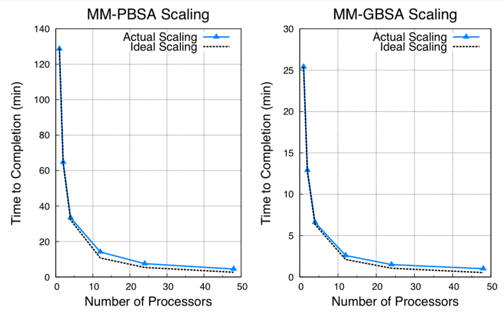

## Before running gmx_MMPBSA

gmx_MMPBSA requires minimal preprocessing of the input structure and trajectory files. Before running gmx_MMPBSA,
complete the following checks.

??? tip "Check the structure supplied with `-cs`, `-rs`, or `-ls`"
        
    Visualize the structure contained in the structure input file given in the `-cs`, `-rs`, or `-ls` 
    options and make sure it is intact and centered (Figure 1, right). A "broken" structure (Figure 1, left) can
    produce inconsistent results.
    
    _Generate the structure from a *.tpr file:_
        
        gmx editconf -f md.tpr -o md.pdb
    
    <figure markdown="1">
    [![overview][4]][4]
      <figcaption markdown="1" style="margin-top:0;">
    **Figure 1.** Visualization of two input structure files. Left: "broken" structure; right: centered structure
      </figcaption>
    </figure>

[4]: assets/images/q_a/inconsistent_str.png

??? tip "Remove PBC artifacts from trajectories supplied with `-ct`, `-rt`, or `-lt`"

    Visualize the trajectory supplied with `-ct`, `-rt`, or `-lt` and make sure periodic-boundary artifacts have
    been removed (Figure 2, right). An unfitted or broken trajectory (Figure 2, left) can produce inconsistent results.
    
    Steps:

    1. Generate a group that contains both molecules
        
            gmx make_ndx -n index.ndx
    
            >1 | 12
    
            >q

        _Assuming 1 is the receptor and 12 is the ligand. This creates a new group (number 20 in this example)_
    
    2. Remove PBC artifacts
        
            gmx trjconv -s md.tpr -f md.xtc -o md_noPBC.xtc -pbc mol -center -n -ur compact
            center: 20 (created group)
            output: 0
    
    3. Remove rotation and translation relative to the reference structure (optional)
        
            gmx trjconv -s md.tpr -f md_noPBC.xtc -o md_fit.xtc -n -fit rot+trans
            fit: 20 (created group)
            output: 0
        
    4. Inspect the processed trajectory
        
        Make sure that the trajectory is intact and centered (Figure 2, right).

    5. If the process is unsuccessful, consider another option such as `-pbc nojump` (as suggested [here][5]).

    <figure markdown="1">
    [![overview][3]][3]
      <figcaption markdown="1" style="margin-top:0;">
    **Figure 2.** Visualization of two input trajectories. Left: trajectory with PBC artifacts;
    right: centered and fitted trajectory with PBC artifacts removed.
      </figcaption>
    </figure>

[3]: assets/images/q_a/traj_comp.gif
[5]: https://github.com/Valdes-Tresanco-MS/gmx_MMPBSA/issues/353

## Running gmx_MMPBSA

!!! tip
    * Since version 1.4.0 we have fixed the `gmx_MMPBSA` inconsistencies when using `MPI`.
    * **We currently recommend the use of MPI since the computation time decreases considerably.**

=== "Parallel (MPI) version"
    Like `MMPBSA.py`, `gmx_MMPBSA` uses MPI only for the energy calculations. The remaining steps —such as generating
    or converting Amber topologies, preparing mutations, and dividing trajectories— run in a single thread (see
    **Figure 3**). AmberTools and GROMACS therefore do not need to be compiled with MPI support. The preprocessing
    time depends on the system and is the same for serial and MPI runs.

    !!! note
        Note that `gmx_MMPBSA` processes, converts, or builds topologies from GROMACS files, so it takes slightly 
        longer than `MMPBSA.py` at the same stage of the process. However, this is not really significant.

    ???+ tip "Remember" 
        Make sure that you install the OpenMPI library
        
            sudo apt install openmpi-bin libopenmpi-dev openssh-client

    A usage example is shown below:

    === "Local"
    
            mpirun -np 2 gmx_MMPBSA -O -i mmpbsa.in -cs com.tpr -ci index.ndx -cg 1 13 -ct com_traj.xtc
    
    === "HPC"
    
            #!/bin/sh
            #PBS -N nmode
            #PBS -o nmode.out
            #PBS -e nmode.err
            #PBS -m abe
            #PBS -M email@domain.edu
            #PBS -q brute
            #PBS -l nodes=1:surg:ppn=3
            #PBS -l pmem=1450mb or > 5gb for nmode calculation
            
            cd $PBS_O_WORKDIR
            
            mpirun -np 3 gmx_MMPBSA -O -i mmpbsa.in -cs com.tpr -ci index.ndx -cg 1 13 -ct com_traj.xtc > progress.log

    
    !!! danger
        When running `gmx_MMPBSA` with MPI, do not use the GROMACS `gmx_mpi` executable because it can conflict with
        `mpirun`. Use `gmx` instead. Only `mdrun` benefits from GROMACS MPI parallelization; the GROMACS tools called by
        gmx_MMPBSA run in a single thread. See [issue 26](https://github.com/Valdes-Tresanco-MS/gmx_MMPBSA/issues/26)
        for an example.

    !!! warning
        The nmode calculations require a considerable amount of RAM. Consider that the total amount of RAM will be:

        RAM~total~ = RAM~1_frame~ * NUM of Threads
        
        If it consumes all the RAM of the system it can cause crashes, instability or system shutdown!
        

    !!! note
        At a certain level, running RISM in parallel may actually hurt performance, since previous solutions are used 
        as an initial guess for the next frame, hastening convergence. Running in parallel loses this advantage. Also, 
        due to the overhead involved in which each thread is required to load every topology file when calculating 
        energies, parallel scaling will begin to fall off as the number of threads reaches the number of frames. 

=== "Serial version"
    This version is installed via pip as described above. `AMBERHOME` variable must be set, or it will quit with an error. 
    An example command-line call is shown below:
    
        gmx_MMPBSA -O -i mmpbsa.in -cs com.tpr -ci index.ndx -cg 1 13 -ct com_traj.xtc
    
    You can find test files on [GitHub][1].

  [1]: https://github.com/Valdes-Tresanco-MS/gmx_MMPBSA/tree/master/docs/examples

<figure markdown="1">
{ width=70% style="display: block; margin: 0 auto"}
  <figcaption markdown="1" style="margin-top:0;">
  **Figure 3**. **`MPI` benchmark description from <a href="https://pubs.acs.org/doi/10.1021/ct300418h">MMPBSA.py 
paper</a>.**
  `MMPBSA.py` scaling comparison for `MM-PBSA` and `MM-GBSA` calculations on 200 frames of a 5910-atom complex. Times 
  shown are the times required for the calculation to finish. Note that `MM-GBSA` calculations are ∼5 times faster 
  than `MM-PBSA` calculations. All calculations were performed on NICS Keeneland (2 Intel Westmere 6-core CPUs per 
  node, QDR infiniband interconnect) 
  </figcaption>
</figure>

[2]: assets/images/mmpbsa_py_mpi.png