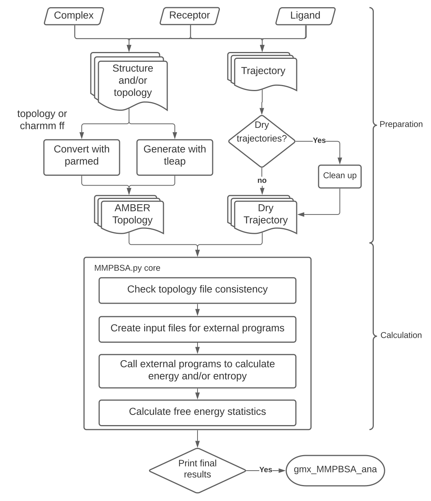

# How gmx_MMPBSA works

gmx_MMPBSA is a tool based on AMBER's MMPBSA.py that performs end-state free energy calculations using GROMACS files.

**But, what does that mean?**

Basically, `gmx_MMPBSA` provides many supported [MMPBSA.py][1] workflows and additional GROMACS-oriented tooling.
The supported subset depends on the input format, force field, solvent model, entropy method, and trajectory protocol;
see [compatibility and upgrades](compatibility.md) and the [native-AMBER guide](amber_MMPBSA.md) for explicit limits.

[MMPBSA.py][1] is a well-established tool for performing end-state binding free energy calculations in AMBER.
Tools such as `g_mmpbsa` are also well known within the GROMACS community. However, using MMPBSA.py with GROMACS
inputs traditionally requires substantial file conversion and workflow setup.

We created `gmx_MMPBSA` to make this workflow accessible to the GROMACS community. It automates the required
preparation, supports additional calculation options, and includes the `gmx_MMPBSA_ana` graphical application for
analyzing the results. It also makes several advanced MMPBSA.py capabilities easier for new Amber users to access.

## gmx_MMPBSA general workflow

The gmx_MMPBSA workflow has three stages, as shown in Figure 1. During `Preparation`, the program generates the
topologies and trajectories, together with calculation-specific inputs such as mutant structures for alanine/glycine
scanning or lists of interacting residues for decomposition analysis. During `Calculation`, it estimates the binding
free energies and/or entropies using the selected models. During `Analysis`, the results can be examined with the
`gmx_MMPBSA_ana` graphical interface.

<figure markdown="1">
{ width=75% style="display: block; margin: 0 auto"}
  <figcaption markdown="1" style="margin-top:0;">
  **Figure 1**. `gmx_MMPBSA` general workflow
  </figcaption>
</figure>

[2]: assets/images/workflow.svg

[comment]: <> (![Placeholder]&#40;assets/images/workflow.svg&#41;)

[comment]: <> (**Figure 1:** gmx_MMPBSA general workflow)

## Topology preparation

gmx_MMPBSA requires several input files to prepare the topologies for the calculations.

`MD Structure+mass(db) (*.tpr, *.pdb)`
:   This file is used with `editconf` or `trjconv` to generate the complex structure in PDB format. We recommend
    using the `*.tpr` (production `*.tpr`) format. Coordinates and atom order must match the GROMACS topology.

`Index (*.ndx)` 
:   This file organizes atoms from the `*.tpr` file into index groups. It is required to identify the groups
    corresponding to the receptor and ligand.

`Trajectory (*.xtc, *.trr, *.pdb)`
:   Trajectory files.

`Topology (*.top)` **required**
:   GROMACS topology containing the force-field parameters used in the MD. `gmx_MMPBSA` converts this topology with
    ParmEd (`-cp`; and `-rp`/`-lp` for unbound MT tops). Structure-only rebuilds through tleap from extracted PDBs are
    not supported. Small-molecule ligands must already be present in the topology tree.

`Reference Structure`
:   This optional PDB file must contain the complete complex, with the same atoms and residues as the structure supplied
    for the calculation. It should also contain the intended residue numbering and chain IDs. We recommend providing a
    reference structure because gmx_MMPBSA uses this information when it extracts the receptor and ligand, prepares
    alanine-scanning mutations, and performs other structure-sensitive operations.
