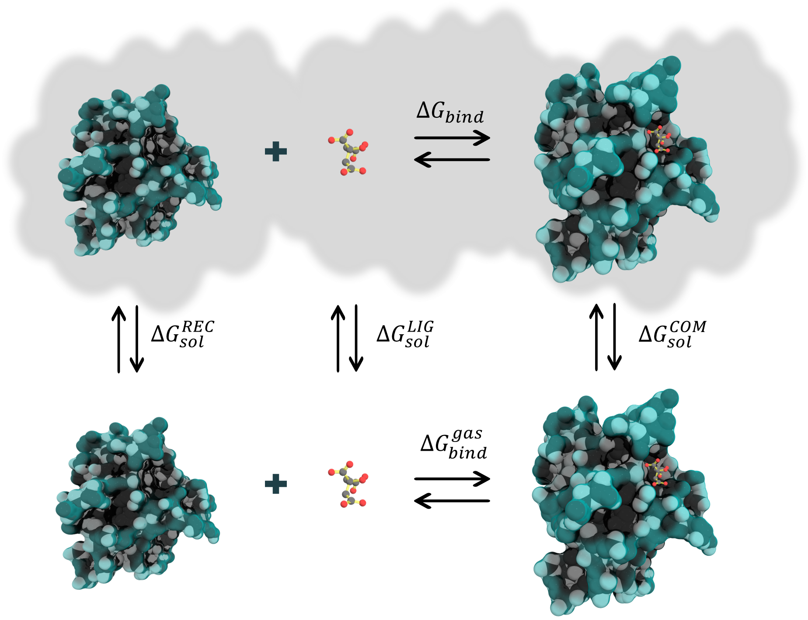

# Introduction

The MM/PB(GB)SA method can be used to calculate the binding free energies of noncovalently bound complexes.

<figure markdown="1">
{ width=50% style="display: block; margin: 0 auto"}
  <figcaption markdown="1" style="margin-top:0;">
**Figure 1.** Thermodynamic cycle for binding free energy calculations
  </figcaption>
</figure>

[16]: assets/images/cycle.png

The binding free energy of a complex can be estimated as follows:

    ∆𝐺𝑏𝑖𝑛𝑑 = 〈𝐺𝐶𝑂𝑀〉−〈𝐺𝑅𝐸𝐶〉−〈𝐺𝐿𝐼𝐺〉

    (1)

where each term on the right-hand side is given by:

〈𝐺𝑥〉 = 〈𝐸𝑀𝑀〉 + 〈𝐺𝑠𝑜𝑙〉 − 〈𝑇𝑆〉

    (2)

In turn, ∆𝐺𝑏𝑖𝑛𝑑 can also be represented as:

∆𝐺𝑏𝑖𝑛𝑑 = ∆𝐻 − 𝑇∆𝑆

    (3)

where ∆𝐻 corresponds to the enthalpy of binding and −𝑇∆𝑆 to the conformational entropy after ligand binding. When the 
entropic term is omitted, the computed value is the effective free energy, which is usually sufficient for
comparing relative binding free energies of related ligands.

The enthalpy, ∆𝐻, can be decomposed into different terms:

∆𝐻 = ∆𝐸𝑀𝑀 + ∆𝐺𝑠𝑜𝑙

    (4)

where:

∆𝐸𝑀𝑀 = ∆𝐸𝑏𝑜𝑛𝑑𝑒𝑑 + ∆𝐸𝑛𝑜𝑛𝑏𝑜𝑛𝑑𝑒𝑑 = (∆𝐸𝑏𝑜𝑛𝑑 + ∆𝐸𝑎𝑛𝑔𝑙𝑒 + ∆𝐸𝑑𝑖ℎ𝑒𝑑𝑟𝑎𝑙) + (∆𝐸𝑒𝑙𝑒 + ∆𝐸𝑣𝑑𝑊)

    (5)

The gas phase free energy contributions (∆𝐸𝑀𝑀) are calculated by `sander` within the AmberTools package 
according to the force field used in the MD simulation. 

The ∆𝐺𝑠𝑜𝑙 is given by:

∆𝐺𝑠𝑜𝑙 = ∆𝐺𝑝𝑜𝑙 + ∆𝐺𝑛𝑜𝑛−𝑝𝑜𝑙 = ∆𝐺𝑃𝐵/𝐺𝐵 + ∆𝐺𝑛𝑜𝑛−𝑝𝑜𝑙

    (6)

where:

∆𝐺𝑛𝑜𝑛−𝑝𝑜𝑙𝑎𝑟 = 𝑁𝑃𝑇𝐸𝑁𝑆𝐼𝑂𝑁 ∗ ∆𝑆𝐴𝑆𝐴 + 𝑁𝑃𝑂𝐹𝐹𝑆𝐸𝑇

    (7)

or,

∆𝐺𝑛𝑜𝑛−𝑝𝑜𝑙 = ∆𝐺𝑑𝑖𝑠𝑝 + ∆𝐺𝑐𝑎𝑣𝑖𝑡𝑦 = ∆𝐺𝑑𝑖𝑠𝑝 + (𝐶𝐴𝑉𝐼𝑇𝑌𝑇𝐸𝑁𝑆𝐼𝑂𝑁 ∗ 
∆𝑆𝐴𝑆𝐴 + 𝐶𝐴𝑉𝐼𝑇𝑌𝑂𝐹𝐹𝑆𝐸𝑇)

    (8)

In the above equations, ∆𝐸𝑀𝑀 corresponds to the molecular mechanical energy changes in the
gas phase. ∆𝐸𝑀𝑀 includes ∆𝐸𝑏𝑜𝑛𝑑𝑒𝑑, also known as internal energy, and 
∆𝐸𝑛𝑜𝑛𝑏𝑜𝑛𝑑𝑒𝑑, corresponding to the van der Waals and electrostatic contributions. The solvation energy is 
determined differently depending on the method employed. In the 3D-RISM model, both the polar and nonpolar components
of the solvation energy are calculated. However, the PB and GB models estimate only the polar component of the 
solvation energy. The nonpolar component is usually assumed to be proportional to the molecule's total solvent-accessible
surface area (SASA), with a proportionality constant derived from experimental solvation energies of small nonpolar
molecules (Eq. 7). Alternatively, a modern approach that separates nonpolar solvation free energies into cavity and
dispersion terms can be used. In this approach, SASA is used to correlate the cavity term only, while a 
surface-integration method is employed to compute the dispersion term (Eq. 8).

Furthermore, the entropic component is usually calculated by normal modes analysis (NMODE). The translational and
rotational entropies can be estimated using standard statistical mechanical formulas. Nevertheless, calculating
vibrational entropy using normal modes is computationally expensive because it requires expanding the internal
coordinate covariance matrix for all degrees of freedom for a set of minimized structures. Recently, other
alternatives have been developed, such as NMODE in truncated systems, which considerably reduces the computational
cost. Interaction Entropy (IE) is another method that
calculates the entropic component of the binding free energy directly from MD simulations without any extra 
computational cost. This method is numerically reliable, more computationally efficient, and superior to the 
standard NMODE approach, as shown in an extensive study of over a dozen randomly selected protein-ligand binding 
systems.

Typically, MM/PB(GB)SA calculations use one of two approaches: the single-trajectory protocol (STP) or the
multiple-trajectory protocol (MTP). In STP, both the receptor and ligand trajectories are extracted
from the complex trajectory. This approach is valid when the bound and unbound states of the receptor and ligand
are similar. It is computationally less expensive than the MTP approach since only a simulation of the complex is 
required. Additionally, the potential internal terms (_e.g._, bonds, angles, and dihedrals) cancel exactly in STP 
since these terms are the same in both bound and unbound states. On the other hand, the MTP is a more realistic 
approach because it considers separate trajectories for the complex, receptor, and ligand. However, subtracting
energies from independently sampled conformations can introduce substantial uncertainty. In practice, the system
must be studied carefully to select the appropriate approach.

## Literature
Further information can be found in [Amber manual][3]:

* [MMPBSA.py][4]
* [The Generalized Born/Surface Area Model][5]
* [PBSA][6]
* [Reference Interaction Site Model][7]
* [Generalized Born (GB) for QM/MM calculations][8]

and the foundational papers:

* [Srinivasan J. et al., 1998][9] 
* [Kollman P. A. et al., 2000][10] 
* [Gohlke H., Case D. A. 2004][11] 

as well as some reviews and expert opinions:

* [Genheden S., Ryde U. 2015][12] 
* [Wang et. al., 2018][13]  
* [Wang et. al., 2019][14]
* [Tuccinardi, 2021][16]

  [1]: https://pubs.acs.org/doi/10.1021/ct300418h
  [2]: https://pubs.acs.org/doi/abs/10.1021/jacs.6b02682

  [3]: https://ambermd.org/doc12/Amber21.pdf
  [4]: https://ambermd.org/doc12/Amber21.pdf#chapter.36
  [5]: https://ambermd.org/doc12/Amber21.pdf#chapter.4
  [6]: https://ambermd.org/doc12/Amber21.pdf#chapter.6
  [7]: https://ambermd.org/doc12/Amber21.pdf#chapter.7
  [8]: https://ambermd.org/doc12/Amber21.pdf#subsection.11.1.3
  [9]: https://pubs.acs.org/doi/abs/10.1021/ja981844+
  [10]: https://pubs.acs.org/doi/abs/10.1021/ar000033j
  [11]: https://onlinelibrary.wiley.com/doi/abs/10.1002/jcc.10379
  [12]: https://www.tandfonline.com/doi/full/10.1517/17460441.2015.1032936
  [13]: https://www.frontiersin.org/articles/10.3389/fmolb.2017.00087/full
  [14]: https://pubs.acs.org/doi/abs/10.1021/acs.chemrev.9b00055
  [15]: https://pubs.acs.org/doi/full/10.1021/acs.jctc.8b00418
  [16]: https://www.tandfonline.com/doi/pdf/10.1080/17460441.2021.1942836
