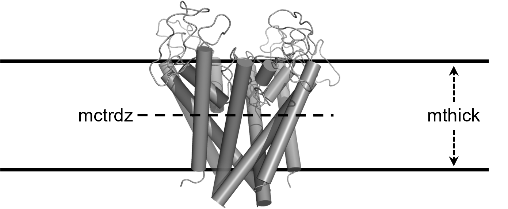

!!! danger "CHARMM and MM(PB/GB)SA"
    PB model is recommended when working with CHARMMff files. Nevertheless, the combination of PB/GB models with radii
    optimized for amber atom types (_i.e._ bondi, mbondi, mbondi2, mbondi3) and CHARMM force field hasn't been tested
    extensively. Please, check this [thread][1] for more information and proceed with caution.

    **:material-new-box:{:.heart } in gmx_MMPBSA v1.5.0!!!**

    In gmx_MMPBSA v1.5.0 we have added a new PB radii set named _charmm_radii_. **This radii set should be used only
    with systems prepared with CHARMM force fields**. The atomic radii set for Poisson-Boltzmann calculations has been
    derived from average solvent electrostatic charge distribution with explicit solvent. The accuracy has been tested
    with free energy perturbation with explicit solvent [ref.](https://pubs.acs.org/doi/10.1021/jp970736r). Most of
    the values were taken from a _*radii.str_ file used in PBEQ Solver
    in [charmm-gui](https://www.charmm-gui.org/?doc=input/pbeqsolver).

    * Radii for protein atoms in 20 standard amino acids from
    [Nina, Belogv, and Roux](https://pubs.acs.org/doi/10.1021/jp970736r)
    * Radii for nucleic acid atoms (RNA and DNA) from
    [Banavali and Roux](https://pubs.acs.org/doi/abs/10.1021/jp025852v)
    * Halogens and other atoms from [Fortuna and Costa](https://pubs.acs.org/doi/10.1021/acs.jcim.1c00177)

# Protein-ligand embedded in membrane binding free energy calculations (Single Trajectory method) with CHARMMff files

This is the single repository protein-membrane example, using the smaller
CHARMM-GUI system `PROA-UQ2`. `PROA` is the receptor (2,985 atoms) and `UQ2`
is the ligand (49 atoms). The source trajectory was already fitted. The
calculation structure `com.pdb` was generated from
`step6.6_equilibration.tpr`, and `md.xtc` contains its first four
frames from `step6.6_equilibration_fit.xtc`.

!!! info
    This example can be found in the [examples/Protein_membrane][6] directory in the repository folder. If you didn't
    use gmx_MMPBSA_test before, use [downgit](https://downgit.github.io/#/home) to download the specific folder from
    gmx_MMPBSA GitHub repository.

## Requirements

In this case, `gmx_MMPBSA` requires:

| Input File required            | Required |           Type             | Description |
|:-------------------------------|:--------:|:--------------------------:|:-------------------------------------------------------------------------------------------------------------|
| Input parameters file          | :octicons-check-circle-fill-16:{ .req .scale_icon_medium } |           `in`             | input file containing all the specifications regarding the type of calculation that is going to be performed |
| The MD Structure+mass(db) file | :octicons-check-circle-fill-16:{ .req .scale_icon_medium } |    `tpr` `pdb`     | Structure file containing the system coordinates|
| Receptor and ligand group      | :octicons-check-circle-fill-16:{ .req .scale_icon_medium } |        `integers`          | Receptor and ligand group numbers in the index file |
| A trajectory file              | :octicons-check-circle-fill-16:{ .req .scale_icon_medium } | `xtc` `pdb` `trr` | final GROMACS MD trajectory, fitted and with no pbc.|
| A topology file                | :octicons-check-circle-fill-16:{ .req .scale_icon_medium } |           `top`            | take into account that *.itp files belonging to the topology file should be also present in the folder       |
| A Reference Structure file     | :octicons-check-circle-fill-16:{ .req_optrec .scale_icon_medium } |           `pdb`            |  Complex reference structure file (without hydrogens) with the desired assignment of chain ID and residue numbers       |

:octicons-check-circle-fill-16:{ .req } -> Must be defined -- :octicons-check-circle-fill-16:{ .req_optrec } ->
Optional, but recommended -- :octicons-check-circle-fill-16:{ .req_opt } -> Optional

_See a detailed list of all the flags in gmx_MMPBSA command line [here][2]_

## Command-line
That being said, once you are in the folder containing all files, the command-line will be as follows:

=== "Serial"

        gmx_MMPBSA -O -i mmpbsa.in -cs com.pdb -ci index.ndx -cg 6 5 -ct md.xtc -cp topol.top -o FINAL_RESULTS_MMPBSA.dat -eo FINAL_RESULTS_MMPBSA.csv

=== "With MPI"

        mpirun -np 2 gmx_MMPBSA -O -i mmpbsa.in -cs com.pdb -ci index.ndx -cg 6 5 -ct md.xtc -cp topol.top -o FINAL_RESULTS_MMPBSA.dat -eo FINAL_RESULTS_MMPBSA.csv

=== "gmx_MMPBSA_test"

        gmx_MMPBSA_test -t 6

where the `mmpbsa.in` input file, is a text file containing the following lines:

``` yaml linenums="1" title="Sample input file for MMPBSA with membrane proteins"
Sample input file for MMPBSA with membrane proteins
This input file is meant to show only that gmx_MMPBSA works. Althought,
we tried to used the input files as recommended in the Amber manual,
some parameters have been changed to perform more expensive calculations
in a reasonable amount of time. Feel free to change the parameters
according to what is better for your system.

&general
sys_name="Prot-Memb-PROA-UQ2",
startframe=1,
endframe=4,
# In gmx_MMPBSA v1.5.0 we have added a new PB radii set named charmm_radii.
# This radii set should be used only with systems prepared with CHARMM force fields.
# Uncomment the line below to use charmm_radii set
#PBRadii=7,
/
&pb
memopt=1, emem=7.0, indi=1.0,
mctrdz=automatic, mthick=automatic, membrane_atoms="P", poretype=1,
radiopt=0, istrng=0.150, fillratio=1.25, inp=2,
sasopt=0, solvopt=2, ipb=1, bcopt=10, nfocus=1, linit=1000,
eneopt=1, cutfd=7.0, cutnb=99.0,
maxarcdot=15000,
npbverb=1,
/
```

!!! warning "Remember"
    `radiopt = 0` is recommended which means using radii from the `prmtop` file

_See a detailed list of all the options in `gmx_MMPBSA` input file [here][3] as well as several [examples][4]_

!!! note "Automatic membrane parameters"
    The membrane center and thickness are determined automatically from the selected complex trajectory using
    `mctrdz=automatic`, `mthick=automatic`, and `membrane_atoms="P"`. The phosphorus atoms in the
    phospholipid headgroups define the two leaflets. The membrane normal must be aligned with *z*, and the trajectory
    should be continuous across periodic boundaries.

    Automatic detection reads the original, unstripped `-ct` trajectory, so membrane lipids do not need to be part of
    the receptor group selected with `-cg`. The calculation retains
    `GMXMMPBSA_membrane_parameters.csv` and `GMXMMPBSA_membrane_parameters.png` as diagnostics.

    

    Fixed numeric values can be supplied instead when preferred. Automatic and numeric center/thickness settings can
    also be mixed.

## Considerations
The system contains one `PROA` protein, one `UQ2` ligand, a DOPC/POPC
membrane, sodium and chloride ions, and TIP3 water from CHARMM-GUI. The
single-trajectory calculation uses `com.pdb`, `index.ndx`, `md.xtc`,
`topol.top`, and the receptor/ligand groups `6 5`, corresponding to `PROA`
and `UQ2`, respectively. The topology and all included CHARMM force-field
files are kept together under `toppar/`.

The membrane is represented through the implicit membrane PB settings in
`mmpbsa.in`; the explicit membrane, solvent, and ions remain in the
calculation-ready coordinate/topology package. The input keeps the repository
example's four-frame demonstration range (`startframe=1`, `endframe=4`).

!!! note "Comments on parameters for implicit membranes"
    The inclusion of an implicit membrane region in implicit solvation calculations is enabled by setting
    `memopt` to 1 (default value is 0, for off). The membrane will extend the solute dielectric region to include a
    slab-like planar region of uniform dielectric constant running parallel to the xy plane. The dielectric constant
    can be controlled using `emem`. We set the membrane interior dielectric constant to a value of 7.0 in this example.
    The value of `emem` should always be set to a value greater than or equal to `indi` (solute dielectric constant,
    1 in this example) and less than `exdi` (solvent dielectric constant, 78.5 default).

    []()

    The membrane center and thickness are resolved automatically from the selected trajectory using
    `mctrdz=automatic`, `mthick=automatic`, and `membrane_atoms="P"`. Fixed numeric values can be supplied
    instead when a specific membrane placement is required. If calculations are performed on a protein with a
    solvent-filled channel region, this region is identified automatically by setting `poretype=1`.

    When using the implicit membrane model, the default `sasopt=0`, _i.e._ the classical solvent excluded
    surface, is recommended due to its better numerical behavior. When running with the default options, the program
    will compute solvent excluded surfaces both with the water probe (`prbrad=1.40` by default) and the membrane probe
    (`mprob=2.70` by default). This setting was found to be consistent with the explicit solvent MD simulations.

    It is also suggested that periodic boundary conditions be used to avoid unphysical edge effects. This is supported
    in all linear solvers. In the following, Geometric multigrid is chosen (`solvopt=2`) with `ipb=1` and `bcopt=10`.
    The `linit=1000` should work fine, but take into account that working with linear and periodic boundary conditions
    could require more iterations.

    In addition, `eneopt` needs to be set to 1 because the charge-view method (`eneopt = 2`) is not supported for
    this application. When `eneopt=1`, the total electrostatic energy and forces will be
    computed with the particle-particle particle-mesh (P3M) procedure outlined in Lu and Luo.[8] In doing so,
    energy term `EPB` in the output file is set to zero, while `EEL` term includes both the reaction field
    energy (`EPB`) and the Coulombic energy (`EEL`). The van der Waals energy is computed along with the
    particle-particle portion of the Coulombic energy. This option requires a nonzero CUTNB (in this case, `cutnb=8.0`).
    It's noteworthy mentioning that `ΔGGAS` and `ΔGSOLV` as reported are no longer
    properly decomposed. Since `EPB` and `EEL` are combined into the "gas phase" term, the gas and solvation terms
    can't be separated. Nevertheless, the total ΔTOTAL should be perfectly fine, since everything is sum up together
    in the end.

    !!! Danger
        Note that a smaller `fillratio=1.25` is used compared to the defult one (4.0). The use of a periodic boundary
        also allowed a somewhat small fill ratio (_i.e._, the ratio of the finite-difference box dimension over the
        solute dimension) of 1.25 to be used in these
        calculations ([ref](https://pubs.acs.org/doi/full/10.1021/acs.jctc.7b00382)). Be cautious when changing this
        parameter as its increase may lead to a considerable RAM usage (specially when running the program in parralel).

A plain text output file with all the statistics (default: `FINAL_RESULTS_MMPBSA.dat`) and a CSV-format
output file containing all energy terms for every frame in every calculation will be saved. The file name in
'-eo' flag will be forced to end in [.csv] (`FINAL_RESULTS_MMPBSA.csv` in this case). This file is only written when
specified on the command-line.


!!! note
    Once the calculation is done, the results can be analyzed in `gmx_MMPBSA_ana` (if `-nogui` flag was not used in the command-line).
    Please, check the [gmx_MMPBSA_ana][5] section for more information


  [1]: http://archive.ambermd.org/201508/0382.html
  [2]: ../../gmx_MMPBSA_command-line.md#gmx_mmpbsa-command-line
  [3]: ../../input_file.md#the-input-file
  [4]: ../../input_file.md#sample-input-files
  [5]: ../../analyzer.md#gmx_mmpbsa_ana-the-analyzer-tool
  [6]: https://github.com/Valdes-Tresanco-MS/gmx_MMPBSA/tree/master/examples/Protein_membrane
  [7]: ../gmx_MMPBSA_test.md#gmx_mmpbsa_test-command-line
